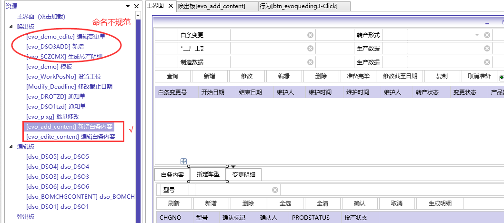

## MES开发教程及规范

###  OBA设计器开发规范

#### 1. 命名要求

   控件名称统一大小写，名称有意义。



后台更改唤出版ID和名称

```sql

SELECT T.IFOBJID, T.IFOBJNAME, T.*, T.ROWID
  FROM SYSOB_IFOBJECT T
 WHERE IFWINID = 'MES_QM_4M_BT'
   AND PRTIFOBJID = 'evo_demo_modify_end_date';
   
SELECT T.IFOBJID, T.IFOBJNAME, T.*, T.ROWID
  FROM SYSOB_IFOBJECT T
 WHERE IFOBJID = 'evo_demo_modify_end_date';
 
SELECT T.*, T.ROWID
  FROM SYSOB_IFOBJPROPTY T
 WHERE IFWINID = 'MES_QM_4M_BT'
   AND OBJID = 'evo_demo_modify_end_date';

```

格式规范建议：

`evo_modify_end_date`：主界面功能按钮弹出`“修改结束日期”`唤出版

`evo_zdcx_add`：子功能 指定车型_新增唤出版

`evo_zdcx_edite`：子功能 指定车型_编辑唤出版


###  OBA设计器开发教程

#### 1. 权限配置

IsEnable 属性

```
& f_permok('~p_Add~')>0 and '?G_LineNo?' is not null
```

#### 2. DSO 

1. Datasql属性值增加注释，在Trace SQL时无需清空历史方便识别。


#### 3. 控件用法

##### 3.1 循环


